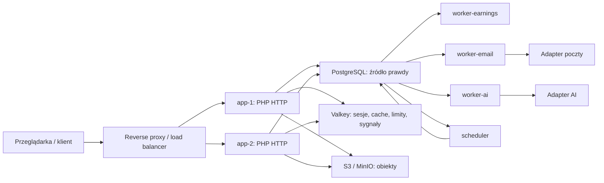

# Architektura systemu

## Cel i stan bieżący

Źródło Słowa jest aplikacją PHP 8.3 przygotowaną do pracy na wielu instancjach.
Lokalne środowisko Docker odwzorowuje docelowy podział odpowiedzialności, ale nie
wiąże kodu z konkretną chmurą. PostgreSQL jest źródłem prawdy, Valkey zapewnia
współdzielone mechanizmy ulotne, a pliki trafiają przez interfejs magazynu obiektów
do MinIO lub usługi zgodnej z S3.

Laragon pozostaje niezależnym środowiskiem zgodności. Docker nie korzysta z jego
MySQL, sesji ani konfiguracji i nie zajmuje portów `80`, `443` ani `3306`.

## Odpowiedzialność komponentów

| Komponent | Odpowiedzialność | Stan trwały |
|---|---|---|
| `proxy` | równoważenie ruchu i izolacja instancji HTTP | brak |
| `app-1`, `app-2` | logowanie, artykuły, panel, API i zapis zadań | brak lokalnego stanu trwałego |
| PostgreSQL | użytkownicy, treści, finanse, audyt, trwałe kolejki i idempotencja | tak |
| Valkey | sesje, cache, rate limiting, krótkie locki i sygnały kolejek | pomocniczy; nie jest źródłem prawdy |
| S3/MinIO | współdzielone uploady i media | tak |
| `worker-earnings` | krytyczne naliczenia finansowe | wynik i stan zadania w PostgreSQL |
| `worker-email` | wysyłka wiadomości poza HTTP | kolejka poczty w PostgreSQL |
| `worker-ai` | wyłącznie zadania administracyjne/redakcyjne | zadanie, koszt i audyt w PostgreSQL |
| `scheduler` | zadania okresowe, w tym anchory księgi | wynik w PostgreSQL |

Instancje WWW są wymienne. Sesja nie zależy od jednej instancji, upload nie trafia
na jej dysk, a wyłączenie `app-1` nie unieważnia sesji obsługiwanej następnie przez
`app-2`. Load balancer nie wymaga sticky sessions.

## Przepływ żądania i pracy asynchronicznej

1. Proxy nadaje lub przekazuje request ID i wybiera zdrową instancję HTTP.
2. Aplikacja odczytuje sesję z Valkey, z kontrolowanym fallbackiem do PostgreSQL.
3. Operacja domenowa zapisuje dane w transakcji PostgreSQL. Jeżeli wymaga pracy w
   tle, w tej samej trwałej warstwie powstaje zadanie z kluczem idempotencji.
4. Valkey może obudzić worker, lecz utrata sygnału nie usuwa zadania.
5. Worker pobiera zadanie przez lease i `FOR UPDATE SKIP LOCKED`, wykonuje je poza
   ścieżką HTTP, a następnie zapisuje wynik, retry albo stan terminalny.

Nie istnieje bezpośrednia ścieżka użytkownika do dostawcy AI. Zadanie AI może
utworzyć tylko aktor administracyjny lub redakcyjny z właściwym uprawnieniem.
Uprawnienie jest ponownie sprawdzane przez worker; obowiązują audyt, limit kosztu i
idempotencja. `worker-ai` ma niższy priorytet zasobów i można go zatrzymać albo
przenieść bez wpływu na HTTP, logowanie, artykuły, salda i naliczenia.

## Granice poprawności i awarii

- PostgreSQL rozstrzyga saldo, historię, status transakcji i stan zadania.
- Valkey może ulec awarii kosztem wydajności, ale nie może zmienić wyniku finansowego.
- Kolejki mają semantykę co najmniej raz; skutek biznesowy jest chroniony kluczem
  idempotencji i ograniczeniem unikalnym w PostgreSQL.
- Awaria przed `COMMIT` nie publikuje skutku. Awaria po `COMMIT`, ale przed
  potwierdzeniem workera, prowadzi do bezpiecznego ponowienia bez drugiego naliczenia.
- Health check liveness nie wykonuje ciężkich zapytań. Readiness kontroluje wymagane
  zależności z krótkimi timeoutami.
- Logi są ustrukturyzowane jako JSON i przenoszą co najmniej request ID, instancję,
  aktora/użytkownika, operację, IP oraz wynik.

## Bezpieczeństwo i wymienność dostawców

Role i uprawnienia są szczegółowe; architektura uwierzytelniania zachowuje miejsce
na późniejsze MFA/passkeys oraz ponowne potwierdzenie operacji krytycznej. Operacje
administracyjne i finansowe generują zdarzenia audytowe.

Sekrety, szyfrowanie, magazyn obiektów, poczta, płatności, AI, logowanie i źródła
uzgodnień finansowych znajdują się za interfejsami lub adapterami. Obecna
implementacja środowiskowa nie wyklucza późniejszego Secret Manager/KMS, SIEM, WAF
ani innego dostawcy. Tych usług nie wdrożono w ETAPIE 10.

## Skalowanie bez sztucznych kosztów

Najpierw mierzone są błędy, p95, kolejki, retry i wykorzystanie bazy. Dopiero potem
zwiększa się liczbę instancji lub workerów. WWW, naliczenia, poczta i AI skalują się
niezależnie. Limity CPU, RAM, PID, połączeń i współbieżności chronią ścieżki
użytkowników. Repliki odczytowe, dodatkowy broker i Kubernetes nie są wymagane,
dopóki pomiary nie wykażą takiej potrzeby.

## Dokumenty szczegółowe

- [Uruchomienie lokalne](URUCHOMIENIE_LOKALNE.md)
- [Migracja do PostgreSQL](MIGRACJA_POSTGRESQL.md)
- [Valkey: cache i kolejki](VALKEY_CACHE_I_KOLEJKI.md)
- [S3 i MinIO](S3_MINIO.md)
- [Finanse i idempotencja](FINANSE_I_IDEMPOTENCJA.md)
- [Skalowanie](SKALOWANIE.md)
- [Testy obciążeniowe](TESTY_OBCIAZENIOWE.md)
- [Plan wdrożenia chmurowego](WDROZENIE_CHMURA.md)
- [Architektura bezpieczeństwa](ARCHITEKTURA_BEZPIECZENSTWA.md)
- [Architektura workerów](ARCHITEKTURA_WORKEROW.md)
